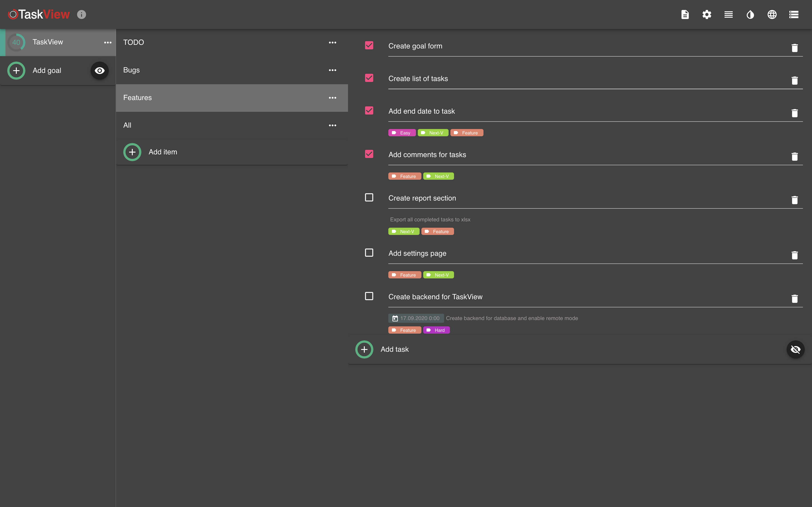

# TaskView  

The TaskView project is being developed as a web application, which consists of both client and server-side components. The main development is done using Vue-3, ZXC_PHP, and PostgreSQL. You can install this application on your own servers.   
Additionally, you can try out the application at [https://taskview.handscream.com](https://taskview.handscream.com).   
You can also participate in the development of the project.  
All version will have next format v1.0.0-w (w - means web application)

## Contacts

[Telegram](https://t.me/hand_scream)  
[Docs](https://gimanh.github.io/task_view_doc/)  
Service for daily planning, aimed at achieving results. For personal affairs, work tasks and teamwork. www.handscream.com

# Desktop app 

> This repository contains the TaskView app! At first, TaskView was developed with ElectronJS, but then I started 
developing TaskView with client-server architecture for browsers. Right now I am focusing on TaskView with 
client-server architecture. 

### ElectronJS  
> In the **App** folder you can find TaskView with ElectronJS.

### TaskView - web  
> **APIServer** - contains the server API for the TaskView spa client.  
**WebApp** - contains a web application developed with NuxtJS and Vuetify.

[TaskViewWeb](https://github.com/Gimanh/handscream/tree/devel-web/APIServer) work in progress.

<h2 align="center">TaskView</h2>  
<p align="center">
  
</p>

## Main workspace
<p align="center">
  
</p>

See more information in [Wiki](https://github.com/Gimanh/handscream/wiki)  

If you have any question or a bug report please open a [Issue](https://github.com/Gimanh/handscream/issues)  

# Team LF  
Hi!  
I am looking for designer to my project for future development!  
The main goal of this project is easy project management and time control.  
Now available only desktop version, server side and mobile version coming soon.  

If you can create beautiful interface or you are interested with you are welcome!  
Write PM or to email hello@handscream.com.

# How to add a new translation

1. Translate one of the existing files in [locale folder](https://github.com/Gimanh/handscream/tree/devel/App/src/renderer/locale)
    * Don't change the keys!
    * Example:
        * en.js
            "selectDatabaseFile": "Select database file",
        * ru.js
            "selectDatabaseFile": "Выберите файл базы данных",
            
2. Save your file with the language code according to ISO 639-1
    * http://www.mathguide.de/info/tools/languagecode.html
        * eg: Languages/en.json
        * eg: Languages/ru.json
        
3. Make a pull request.

### Thanks for the help
* [Jisco](https://github.com/Jisco)


# Devel
TaskView use [better-sqlite3](https://github.com/JoshuaWise/better-sqlite3) for storage see sql diagram before start
* [Database diagram](https://github.com/Gimanh/handscream/blob/devel/App/src/renderer/diagrams/main.png)

#### Build Setup

> An electron-vue project

``` bash
# install dependencies
npm install

# add config file task_view.app.conf.ts and export let notarizeConfig
# notarizeConfig has next property [appBundleId: sting, appPath: string, appleId: string, appleIdPassword: string] 
# all property is required for app notarize in MacOS 

# serve with hot reload at localhost:9080
npm run dev

# build electron application for production
npm run build

# run unit & end-to-end tests
npm test


# lint all JS/Vue component files in `src/`
npm run lint

```

#### Windows build  

>Required software

* `install NodeJS >= 10.16.3`
* `install Python 2.7.1.`
* `npm install --vs2015 -g windows-build-tools`
* `npm run build`

#### Clear cache MAC OS
* Remove dir /Users/`{user}`/Library/Application Support/`{yourElectronApp}`/Cache

This project was generated with [electron-vue](https://github.com/SimulatedGREG/electron-vue) using [vue-cli](https://github.com/vuejs/vue-cli). Documentation about the original structure can be found [here](https://simulatedgreg.gitbooks.io/electron-vue/content/index.html).
